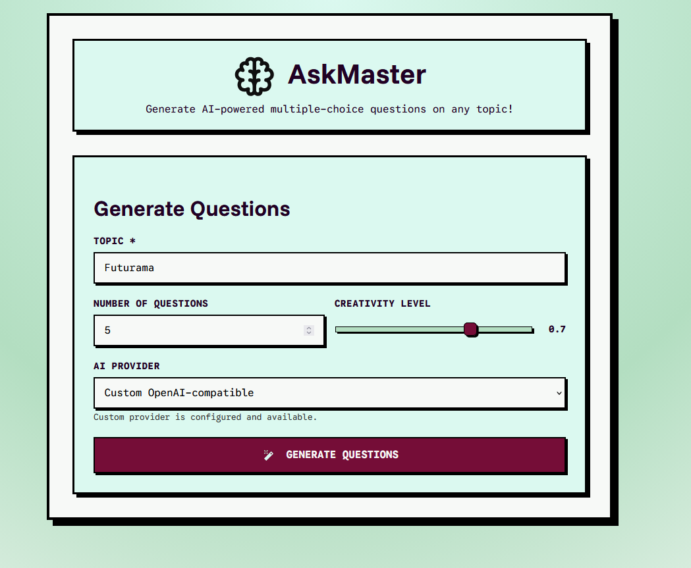

# 🎓 AskMaster

AskMaster is a lightweight SvelteKit application that leverages Google Gemini (Generative AI) to generate multiple-choice questions on any topic. Features include an interactive quiz interface and JSON export capabilities for generated question sets.

---

## ✨ Features

- **AI-Powered Generation**: Uses Google Gemini 2.5-pro to create high-quality multiple-choice questions
- **Dual Provider Support**: Choose between Gemini SDK and OpenAI-compatible endpoints
- **Interactive Quiz Experience**: Navigate through questions with immediate feedback
- **Customizable Parameters**: Control question count (1-20) and creativity level (temperature 0.0-1.0)
- **Export Functionality**: Download generated questions as structured JSON files
- **NeoBrutalism Design**: Bold, high-contrast UI with geometric styling
- **Responsive Design**: Optimized for both desktop and mobile devices



---

## 📦 Prerequisites

- **Node.js**: Version 18 or higher
- **npm**: Package manager for dependencies
- **Google Gemini API Key**: Obtain from [Google AI Studio](https://makersuite.google.com/app/apikey)
- _(Optional)_ Custom OpenAI-compatible configuration:
  - `CUSTOM_API_KEY`: API key for custom endpoint
  - `CUSTOM_MODEL\*\*: Model name for custom endpoint
  - `CUSTOM_BASE_URL\*\*: Base URL for custom OpenAI-compatible API

---

## 🛠 Quick Start

### 1. Clone the Repository

```bash
git clone <repository-url>
cd askmaster
```

### 2. Install Dependencies

```bash
npm install
```

### 3. Configure Environment

```bash
cp .env.example .env
```

Edit the `.env` file and configure your API keys:

```env
# Required for Gemini provider
GEMINI_API_KEY=your_gemini_api_key_here

# Optional - for custom OpenAI-compatible endpoint
CUSTOM_API_KEY=your_custom_api_key
CUSTOM_MODEL=your_custom_model
CUSTOM_BASE_URL=https://your-custom-api-endpoint.com
```

### 4. Start Development Server

```bash
npm run dev
```

The application will be available at `http://localhost:5174`

---

## 🚀 Using the Application

### Question Generation

1. **Enter Topic**: Provide any subject or topic (e.g., "JavaScript", "World History", "Biology")

---

## 🧭 API Reference

### Provider Configuration

AskMaster supports two AI provider options:

1. **Google Gemini SDK** (default)
   - Uses [`@google/generative-ai`](https://www.npmjs.com/package/@google/generative-ai) with the `gemini-2.5-pro` model
   - Requires `GEMINI_API_KEY` environment variable
   - Direct integration with Google's Generative AI services

2. **Custom OpenAI-compatible Endpoint**
   - Sends requests to your configured `CUSTOM_BASE_URL`
   - Uses OpenAI-compatible chat completion format

### POST /api/generate-questions

Generates multiple-choice questions based on the provided topic and parameters.

#### Request Body

```json
{
  "topic": "string (required)",
  "questionCount": "number (1-20, required)",
  "temperature": "number (0.0-1.0, optional, defaults to 0.7)
  "provider": "string ('google' or 'custom', optional, defaults to 'google')"
}
```

#### Response Format

**Success (200 OK)**

```json
[
  {
    "question": "What is the capital of France?",
    "answers": ["Paris", "London", "Berlin", "Madrid"],
  "correctAnswerIndex": 0
}
```

#### HTTP Status Codes

- **200**: Successfully generated questions
- **400**: Bad request (missing required fields)
- **429**: Rate limit exceeded
- **503**: Service temporarily unavailable
- **500**: Internal server error

#### Example Usage

```bash
curl -X POST \
  -H "Content-Type: application/json" \
  -d '{"topic":"JavaScript","questionCount":10,"temperature":0.7,"provider":"google"}' \
  http://localhost:5174/api/generate-questions
```

---

## 🔐 Environment & Security

### Environment Variables

Create a `.env` file with the following variables:

```env
# Required for Gemini provider
GEMINI_API_KEY=your_gemini_api_key_here

# Optional - for custom OpenAI-compatible endpoint
CUSTOM_API_KEY=your_custom_api_key
CUSTOM_MODEL=your_custom_model
CUSTOM_BASE_URL=https://your-custom-api-endpoint.com
```

### Security Best Practices

- **API Key Protection**: Store sensitive keys in environment variables, not in code
- **Input Validation**: All user inputs are validated server-side
- **Error Handling**: User-friendly error messages instead of exposing server details
- **Secret Management**: Use platform-specific secret managers for production deployments

---

## 🧪 Development & Tools

### Available Scripts

```bash
# Start development server
npm run dev

# Build for production
npm run build

# Preview production build locally
npm run preview

# Type checking and Svelte diagnostics
npm run check

# Code formatting and linting
npm run format
npm run lint
```

### Development Workflow

1. **Local Development**: Use `npm run dev` for hot-reload development

- **Type Checking**: Run `npm run check` to verify TypeScript compilation
- **Code Quality**: Use `npm run lint` to check for issues

---

## 📦 Deployment

### Supported Platforms

- **Vercel**: Zero-config deployment with automatic environment variable configuration
- **Netlify**: Supports SvelteKit with adapter-auto
- **Node.js Hosting**: Any platform supporting Node.js 18+

### Deployment Steps

1. **Build the Application**:

   ```bash
   npm run build
   ```

2. **Configure Environment Variables**:
   - Set `GEMINI_API_KEY` in your hosting platform's environment settings

### Environment Configuration

For production deployments, set the following environment variables:

```
GEMINI_API_KEY=your_production_api_key
```

3. **Deploy**:
   - For Vercel: Connect your repository and configure environment variables

- For Netlify: Use the build settings and environment variables panel

---

## ⚠️ Notes & Caveats

### Current Limitations

- **AI Response Consistency**: Gemini's output format may vary; the system includes parsing logic but perfect structure isn't guaranteed
- **Rate Limiting**: Subject to Google Gemini API quotas and rate limits
- **Error Handling**: Falls back to user-friendly error messages rather than mock data
- **Question Quality**: AI-generated questions may vary in quality and consistency

### Recommendations

- **Input Validation**: Always validate user inputs on both client and server sides
- **API Reliability**: Consider implementing retry mechanisms for production use

---

## 🛠 Troubleshooting

### Common Issues

1. **API Key Errors**
   - Ensure `GEMINI_API_KEY` is set in your `.env` file
   - Verify the key is valid and has sufficient quota

- **Network Connectivity**: Check internet connection for API calls
- **Port Conflicts**: Ensure port 5174 is available, or configure a different port in `vite.config.ts`

2. **Build Failures**
   - Run `npm run check` to identify TypeScript errors
   - Use `npm run lint` to check for code quality issues

### Error Messages

- **"Gemini API key is missing or empty"**: Check your `.env` file configuration
- **"Failed to generate questions"**: Check API key validity and network connectivity

---

## 🧑‍🤝‍🧑 Contributing

### How to Contribute

1. **Fork** the repository
2. **Create a Feature Branch**: `git checkout -b feature/amazing-feature`
3. **Commit Your Changes**: `git commit -m 'Add some amazing feature'`
4. **Push to the Branch**: `git push origin feature/amazing-feature`
5. **Open a Pull Request**

### Pre-PR Checklist

- [ ] Run `npm run check` for TypeScript validation
- [ ] Run `npm run lint` to ensure code quality
- [ ] Test all functionality locally
- [ ] Verify environment variables are not included
- [ ] Update documentation as needed

---

## 📝 License

This project is licensed under the MIT License — see [`LICENSE`](LICENSE).

---

## ❤️ Acknowledgements

Built with SvelteKit, Vite, and the Google Generative AI SDK.

**Technologies Used**:

- [SvelteKit](https://kit.svelte.dev/) - Full-stack web framework
- [Google Generative AI SDK](https://www.npmjs.com/package/@google/generative-ai)
- [NeoBrutalismCSS](https://matifandy8.github.io/NeoBrutalismCSS/) - UI design framework
- [TypeScript](https://www.typescriptlang.org/) - Type safety and developer experience
